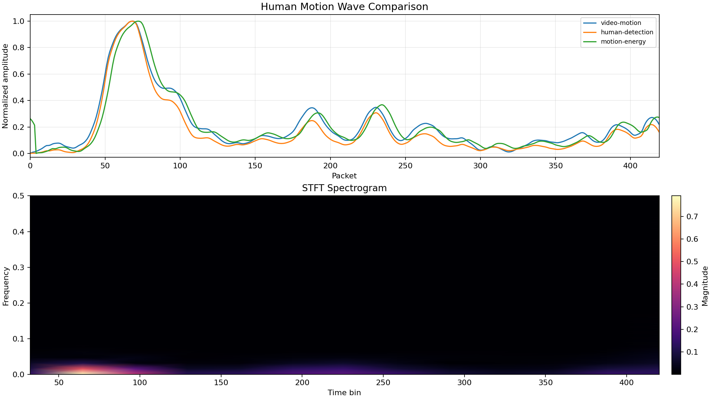
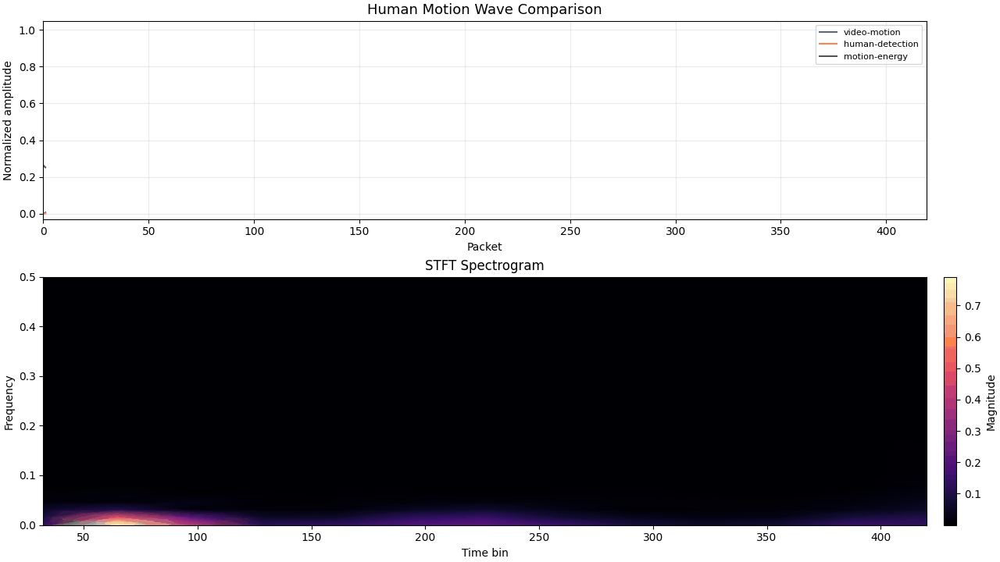
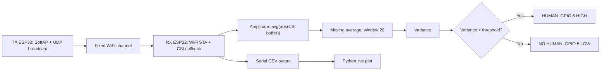

# WiFi CSI Human Detection With 2 ESP32-WROOM Boards

A minimal WiFi Channel State Information (CSI) human-motion detection project using two ESP32-WROOM boards.

The project uses:

- one ESP32 as a fixed-channel WiFi transmitter
- one ESP32 as a CSI receiver
- ESP-IDF WiFi CSI APIs from Arduino-style code
- a simple moving-average + variance detector
- GPIO 5 relay/light output
- Python real-time serial plotting

This repo is designed for a low-memory ESP32-WROOM setup and keeps firmware logs minimal.

## Demo Output

### Research-style CSI motion comparison



### Animated motion response



## Project Structure

```text
.
|-- tx_esp32/                 Arduino IDE sketch for TX ESP32
|-- rx_esp32/                 Arduino IDE sketch for RX ESP32
|-- src/                      PlatformIO source files for TX/RX builds
|-- python/                   Real-time serial plotting tool
|-- docs/
|   |-- assets/               README images and GIFs
|   |-- hardware/             Wiring and board setup notes
|   |-- software/             Plotter and dependency notes
|   |-- SETUP.md              Full setup guide
|   |-- UPLOAD.md             Upload order and commands
|   |-- TUNING.md             Threshold and detection tuning
|   `-- GITHUB_UPLOAD.md      GitHub publishing checklist
|-- platformio.ini            Dual PlatformIO environments: tx and rx
|-- run_plot.bat              One-click graph launcher
|-- pio_tx_build.bat          One-click TX build
|-- pio_rx_build.bat          One-click RX build
|-- setup_python_env.bat      Python dependency installer
`-- README.md
```

## How It Works



## Hardware Required

- 2x ESP32-WROOM development boards
- USB cables for both boards
- optional relay module or LED for detection output
- optional 220 ohm resistor if using LED directly

## Firmware Roles

### TX ESP32

File:

- [tx_esp32/tx_esp32.ino](tx_esp32/tx_esp32.ino)

Behavior:

- starts WiFi SoftAP named `CSI_TX`
- password: `12345678`
- fixed channel: `6`
- sends UDP broadcast packets continuously

### RX ESP32

File:

- [rx_esp32/rx_esp32.ino](rx_esp32/rx_esp32.ino)

Behavior:

- connects to TX SoftAP
- enables CSI with `esp_wifi_set_csi(true)`
- uses `wifi_csi_cb` callback
- computes CSI amplitude with `avg(abs(buf[i]))`
- applies moving average filter
- computes variance
- controls relay/light on GPIO 5
- prints CSV to Serial

## Quick Start

### 1. Upload TX first

Open [tx_esp32/tx_esp32.ino](tx_esp32/tx_esp32.ino) in Arduino IDE and upload to the transmitter ESP32.

### 2. Upload RX second

Open [rx_esp32/rx_esp32.ino](rx_esp32/rx_esp32.ino) in Arduino IDE and upload to the receiver ESP32.

### 3. Open RX serial monitor

Use baud rate:

```text
115200
```

Expected output:

```text
CSI,raw_amp,avg_amp,var,state
CSI,12.34,11.81,4.22,NO_HUMAN
CSI,19.91,14.56,28.40,HUMAN
```

### 4. Run the live Python graph

Install Python dependencies once:

```bat
setup_python_env.bat
```

Run the plotter:

```bat
run_plot.bat COM6 115200
```

Change `COM6` to your RX ESP32 serial port.

## PlatformIO Build

Build TX:

```bat
pio_tx_build.bat
```

Build RX:

```bat
pio_rx_build.bat
```

Manual commands:

```bat
set PLATFORMIO_CORE_DIR=.platformio-core
.venv\Scripts\platformio.exe run -e tx
.venv\Scripts\platformio.exe run -e rx
```

## Relay Output

RX board output:

```text
GPIO 5 HIGH -> HUMAN detected -> light ON
GPIO 5 LOW  -> NO HUMAN       -> light OFF
```

For a relay module:

```text
RX GPIO 5 -> relay IN
RX GND    -> relay GND
Relay VCC -> 5V or 3.3V depending on relay module
```

Use a relay module with proper isolation for AC loads.

## Detection Logic

The current detector is intentionally simple and lightweight:

```text
amplitude = avg(abs(csi_buffer[i]))
smoothed_amplitude = moving_average(amplitude, window=20)
variance = variance(last 20 amplitudes)

if variance > threshold:
    HUMAN
else:
    NO_HUMAN
```

Default threshold:

```cpp
static constexpr float DETECTION_THRESHOLD = 18.0f;
```

If detection is weak, lower the threshold. If it is too sensitive, raise the threshold.

More tuning details are in [docs/TUNING.md](docs/TUNING.md).

## Important Notes

- Upload TX first, then RX.
- Keep both boards powered during testing.
- TX and RX must stay on the same WiFi channel.
- Put the boards 1 to 5 meters apart for first testing.
- Move between TX and RX to create CSI changes.
- Tune the threshold for your room.
- CSI behavior depends on room size, antenna direction, body position, and multipath reflections.

## Useful Docs

- [Setup guide](docs/SETUP.md)
- [Upload guide](docs/UPLOAD.md)
- [Tuning guide](docs/TUNING.md)
- [Hardware wiring](docs/hardware/WIRING.md)
- [Python plotter](docs/software/PLOTTER.md)
- [GitHub upload checklist](docs/GITHUB_UPLOAD.md)

## Status

Verified locally:

- Python virtual environment created
- `matplotlib` installed
- `pyserial` installed
- PlatformIO installed locally
- TX firmware builds successfully
- RX firmware builds successfully

## License

This project is released under the MIT License. See [LICENSE](LICENSE).
